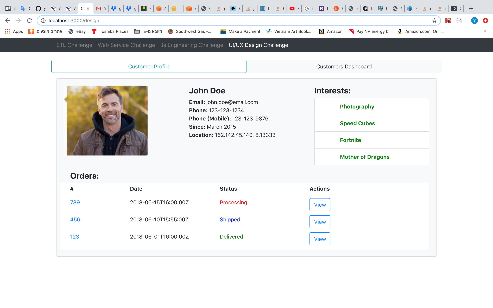
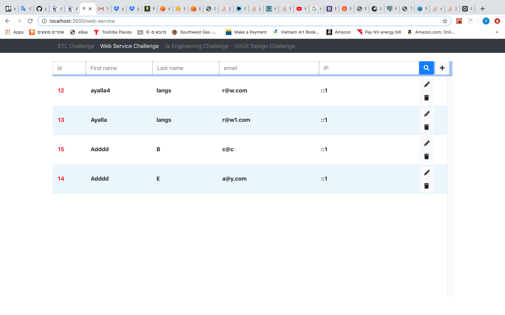

# people10CodeChallenge

## Description

This code was developed with React for FE and Node.jd BE, Using Postgres DB with Sequlize ORM (So you can use MySql as well, Just make sure to config DB and Sequelize with MySql instead of Postgres).

The code will run a React app in port 3000, and Node.js at port 5000.

When code is running you can see in the browser the solutions of all the 4 methods.

## Installation

- Clone project to your computer.
- Run npm install to server and client.

```sh
People10Challenges/server$ npm install
People10Challenges/client$ npm install
```

- Go to your DB shell and create a new db:
  (You can skip this part if you wanna use an existing db)

```sh
postgres=# CREATE DATABASE dbname OWNER rolename;
```

- Go to database file in : server/config/database.js  
  And setup your own bd configuration (DB name, username password etc).

- Go to terminal, inside server folder, and run:

```sh
People10Challenges/server$ npx sequelize-cli init
```

It will create a new config file which you will have to set it up with your db configuration, (In development section of this config json)
It will also create a models folder.

- Set your db configuration in the config file was just created.

- Run the following to create db table:

```sh
npx sequelize-cli model:generate --name Customers --attributes email:string,first_name:string,last_name:string,ip:string,latitude:float,longitude:float
```

It’s gonna create the customers table migration file, and a model file for this table.
(It’s gonna create automatically Id PK, created_at and updated_at)

npx sequelize-cli db:migrate

- Run npx sequelize-cli db:migrate to migrate and create the table in db.

```sh
npx sequelize-cli db:migrate
```

- Go inside db shell and run the following to make email col unique and not null:

```sh
your_db_name=# ALTER TABLE "Customers" ALTER COLUMN "email" SET NOT NULL;
your_db_name=# ALTER TABLE "Customers" ADD UNIQUE ("email");
```

- For ETL challenge: Go to server/routes/api/csvMerge.js and setup the csv files full path.

- Go to server, And run:

```sh
npm run dev
```

(It will run both, client at port 3000, and server at port 5000)

Welcome!!!

## Result

### ETL Engineering Challenge

By pressing the merge button, Node js code will merge the csv files, and return it to this page.


### Web Service Engineering Challenge

You can create, edit, delete, search and read all the cutomers in this page.
(All the data here is from server, By searching it's gonna make a db query for the params was searched).


### JS Engineering Challenge

All the data here is from the given json, By searching it's gonna manipulate given json and view.



### UI/UX Design Challenge

In the customer profile it's only a designed page, In the customers dashboard, it's really works.
(It's the same page as in Web Service Engineering Challenge)


